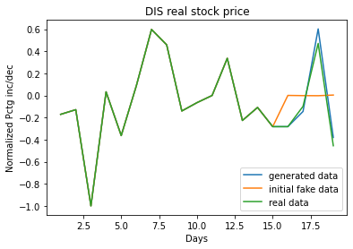

# Exploring the learnability of QGANs
This project is a complete dive into the realm of quantum generative adversarial networks under the context of `$DIS` stock price prediction. Starting with a simple parameterized quantum circuit, to a quantum Wasserstein generative adversarial network, all notebooks are included in the repo. Through several numerical experiments, we hoped to take small empirical stabs at a few prevalent questions in quantum machine learning like: which hyperparameters are optimal for quantum generative adversarial learning, and how do you overcome vanishing gradients? 

With regards to the application of learning consecutive equity prices, we built a proof-of-concept [quantum Wasserstein generative adversarial network](https://github.com/Sinestro38/qosf-qgan/blob/main/Conditional%20QWGAN.ipynb) accompanied with a [traditional quantum generative adversarial network](https://github.com/Sinestro38/qosf-qgan/blob/main/Conditional%20QGAN.ipynb) and a [simple quantum neural network](https://github.com/Sinestro38/qosf-qgan/tree/main/QNN%20Approach) to accomplish the task of predicting the next four days of prices given fifteen prior days of price data. We evaluate quantum model capacity, convergence characteristics, training efficency, and more on the basis of 7 hyperparameters we tuned which were recorded in the [hyperparameter tuning logs](https://github.com/Sinestro38/qosf-qgan/blob/main/Hyperparameter_tuning_logs.pdf).

**Don't know where to start?** Try out a [friendly introduction](https://github.com/Sinestro38/qosf-qgan/blob/main/QGANs%20Explained.md) to quantum generative adversarial networks!

Would also like to express my gratitude to my QOSF mentor Yunong Shi from AWS Braket who helped give direction throughout this project! Many thanks!

## Repo structure
To document the complete journey venturing into the space of QGANs, I've uploaded all the notebooks along the way which guided my decisions along the way.

- `./QGANs explained.md`: [**Learn what QGANs are all about**](https://github.com/Sinestro38/qosf-qgan/blob/main/QGANs%20Explained.md) — An accessible introduction to quantum generative adversarial networks.
- `./QNN Approach/`: [**Preliminary approach**](https://github.com/Sinestro38/qosf-qgan/tree/main/QNN%20Approach) — Here we evaluate the upper bound of the number of data samples a simple quantum neural network can learn/memorize and a naive attempt to see how a simple parameterized quantum circuit could fit to predict DIS stock prices.
- `./Conditional QGAN.ipynb/`: [**QGAN approach**](https://github.com/Sinestro38/qosf-qgan/blob/main/Conditional%20QGAN.ipynb) — Quantum generative adversarial network used to learn n batches of $DIS data samples. Used for hyperparameter tuning.
- `./Conditional QWGAN.ipynb`: [**Final iteration on QGAN approach**](https://nbviewer.jupyter.org/github/Sinestro38/qosf-qgan/blob/main/Conditional%20QWGAN.ipynb) — An advanced quantum generative adversarial network architecture leveraging the Wasserstein metric to determine applicability in learning sequential data. **Includes a thorough explanation of classical WGANs and the Wasserstein metric**!
- `./Hyperparameter_tuning_logs.pdf`: A record of various hyperparameter configurations and the resulting effect on loss and accuracy.
- `./data`: Data fetching and processing into dataset

**_If any of the notebooks fail to load on GitHub, enter the GitHub notebook URL [here](https://nbviewer.jupyter.org/) and you will see it load_**

## Trained examples

## Final model architecture

## References
- Martin Arjovsky, Soumith Chintala, and Léon Bottou. Wasserstein gan. [arXiv:1701.07875, 2017](https://arxiv.org/abs/1701.07875).
- Mehdi Mirza, and Simon Osindero. Conditional Generative Adversarial Nets. [arXiv:1411.1784](https://arxiv.org/abs/1411.1784).
- Bobak Toussi Kiani, et al. Quantum Earth Mover's Distance: A New Approach to Learning Quantum Data. [arXiv:2101.03037](https://arxiv.org/abs/2101.03037)
- Lilian Weng. From GAN to WGAN [arXiv:1904.08994, 2019](https://arxiv.org/pdf/1904.08994.pdf).
- Brownlee. J, 2019. [How to Implement Wasserstein Loss for Generative Adversarial Networks](https://machinelearningmastery.com/how-to-implement-wasserstein-loss-for-generative-adversarial-networks/)
- Brownlee. J, 2019. [How to Develop a Wasserstein Generative Adversarial Network (WGAN) From Scratch](https://machinelearningmastery.com/how-to-code-a-wasserstein-generative-adversarial-network-wgan-from-scratch/)
